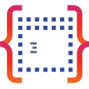

# Bootstrapper API by Codebelt

     

## ℹ️ About

An open-source family of assemblies (MIT license) that provide a uniform and consistent way of bootstraping your code with Program.cs paired with Startup.cs -OR- using the new `Minimal` equivalent for all project types.

Your versatile Bootstrapper companion for modern development with `.NET 9` and `.NET 10`.

It is, by heart, free, flexible and built to extend and boost your agile codebelt.

> [!NOTE]
> To ensure access to current features, improvements, and security updates, and to keep the codebase clean and easy to maintain, we target only the latest long-term (LTS), short-term (STS) and (where applicable) cross-platform .NET versions.

### Codebelt.Bootstrapper

The core types of this lightweight boostrapper framework optimized for console apps, providing a uniform and consistent implementation of:

+ [console](https://docs.microsoft.com/en-us/dotnet/core/tools/dotnet-new#console)-
+ [worker](https://docs.microsoft.com/en-us/dotnet/core/tools/dotnet-new#web-others)-
+ [web](https://docs.microsoft.com/en-us/dotnet/core/tools/dotnet-new#web)-
+ [mvc](https://docs.microsoft.com/en-us/dotnet/core/tools/dotnet-new#web-options)-
+ [webapp](https://docs.microsoft.com/en-us/dotnet/core/tools/dotnet-new#web-options)-
+ [webapi](https://docs.microsoft.com/en-us/dotnet/core/tools/dotnet-new#webapi)-

-project types.

Common for all project types is that they have both `Program.cs` paired with `Startup.cs`. Also, all are implemented using `IHostedService`; this means that for a traditional `console` you have option for graceful shutdown should you require this (cronjob scenarios or similar).

### Codebelt.Bootstrapper.Console

An implementation optimized for `console` applications.

### Codebelt.Bootstrapper.Web

An implementation optimized for `web`, `webapi`, `webapp`, `razor`, `mvc` applications.

### Codebelt.Bootstrapper.Worker

An implementation optimized for `worker` services.

## 📚 Documentation

Full documentation (generated by [DocFx](https://github.com/dotnet/docfx)) located here: https://bootstrapper.codebelt.net/

## 📦 Standalone Packages

Provides a focused API for bootstraping your code with Program.cs paired with Startup.cs -OR- using the new `Minimal` equivalent for all project types.

|Package|vNext|Stable|Downloads|
|:--|:-:|:-:|:-:|
| [Codebelt.Bootstrapper](https://www.nuget.org/packages/Codebelt.Bootstrapper/) |  |  |  |
| [Codebelt.Bootstrapper.Web](https://www.nuget.org/packages/Codebelt.Bootstrapper.Web/) |  |  |  |
| [Codebelt.Bootstrapper.Console](https://www.nuget.org/packages/Codebelt.Bootstrapper.Console/) |  |  |  |
| [Codebelt.Bootstrapper.Worker](https://www.nuget.org/packages/Codebelt.Bootstrapper.Worker/) |  |  |  |

### Contributing to `Bootstrapper API by Codebelt`
[Contributions](.github/CONTRIBUTING.md) are welcome and appreciated.

Feel free to submit issues, feature requests, or pull requests to help improve this library.

### License
This project is licensed under the MIT License - see the [LICENSE](LICENSE.md) file for details.
